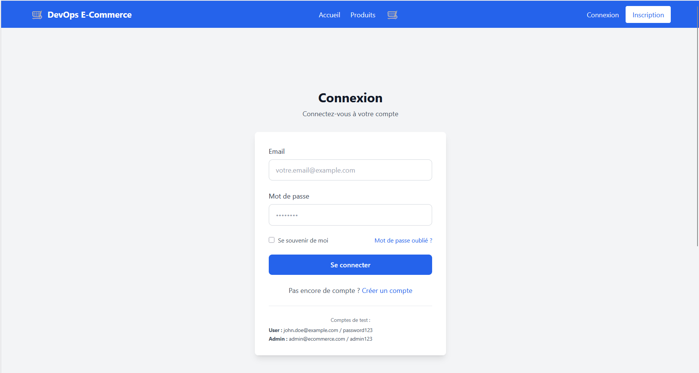
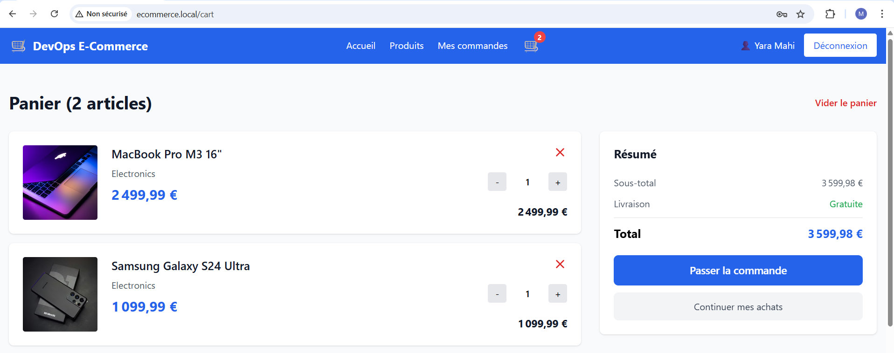
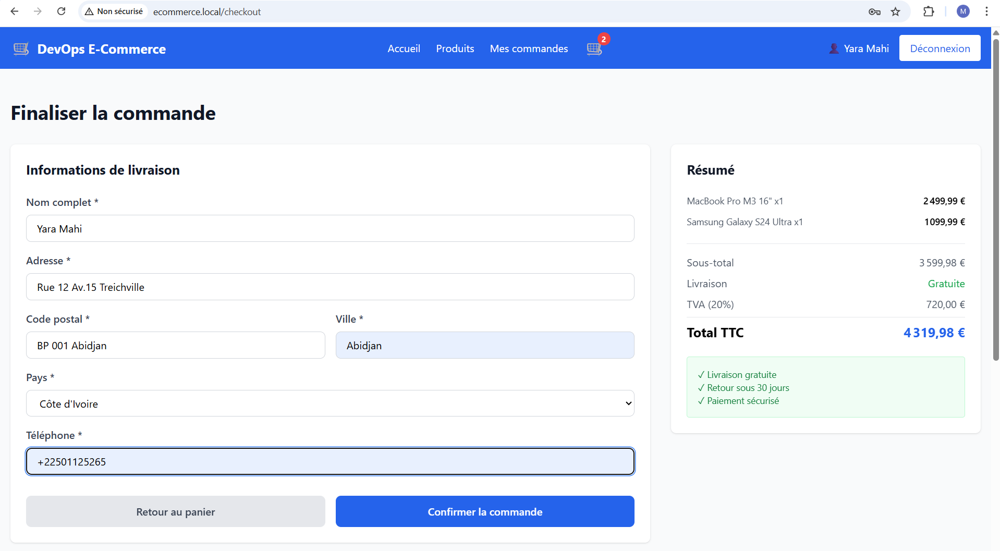
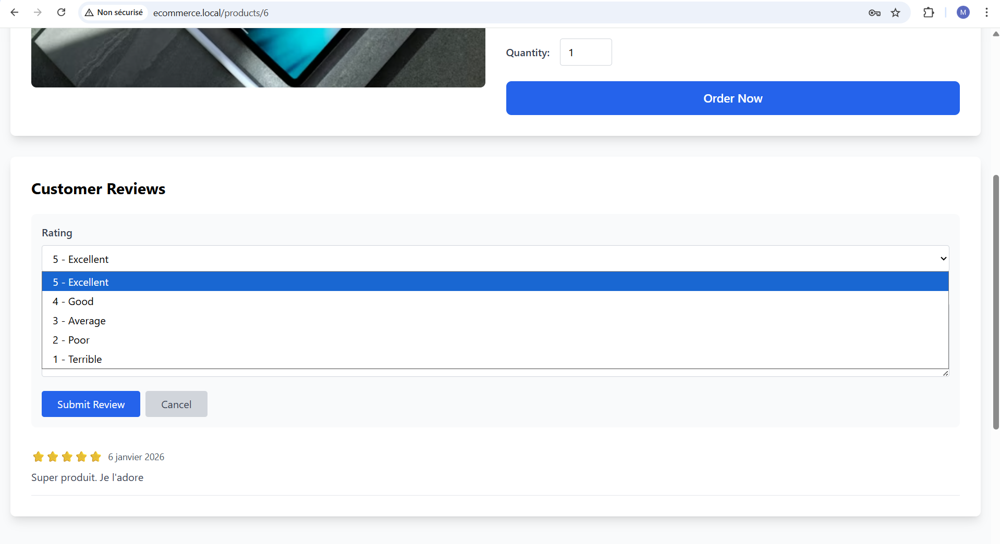
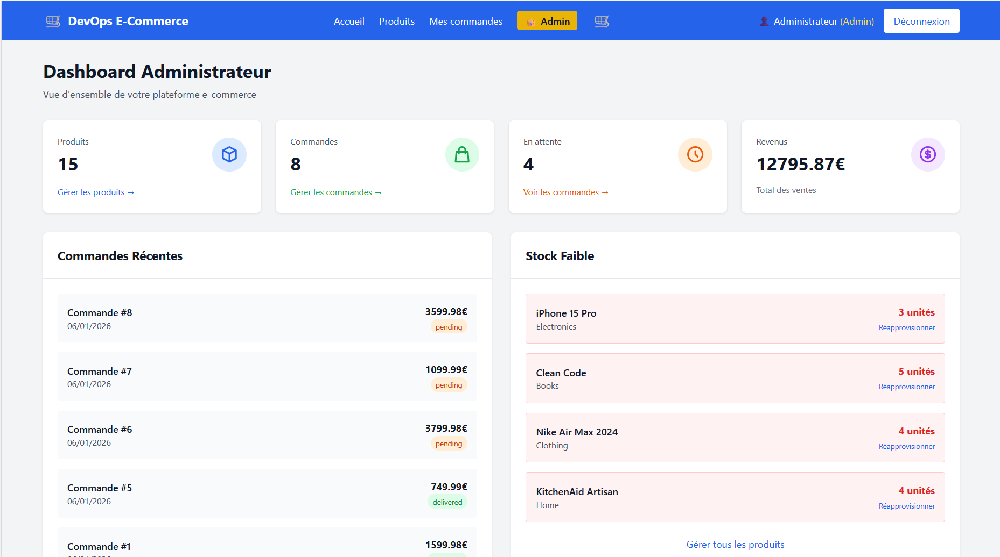
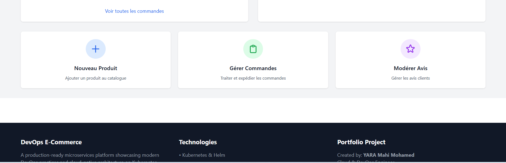

# 🛒 E-Commerce Frontend - Microservices Architecture

Il s'agit une **plateforme e-commerce B2C (Business to Consumer)** avec une architecture **microservices** permettant :
- La gestion du catalogue produits
- L'authentification et la gestion des utilisateurs
- La gestion des commandes
- Le système d'avis/évaluations


---

## 🎯 Fonctionnalités

### ✅ Authentification & Sécurité

- **Inscription utilisateur** avec confirmation
  - Message de succès après inscription
  - Redirection vers page de connexion
  - Pas de connexion automatique
- **Connexion / Déconnexion**
  - JWT Token avec expiration (24h)
  - Message d'alerte si session expirée
  - Redirection automatique vers login
- **Gestion de profil**
- **Protection routes privées**



---


### 🛍️ Catalogue Produits

- **Liste des produits**
  - Recherche et filtres
  - Catégories
  - Tooltip description complète au survol
- **Détails produit**
  - Images
  - Description complète visible
  - Stock en temps réel
  - Avis clients


---


### 🛒 Panier & Commandes

- **Panier d'achat**
  - ⚠️ **Connexion requise** pour ajouter au panier
  - Popup de confirmation si non connecté
  - Modification quantités
  - Persistence localStorage
  - Badge notification dans navbar
- **Checkout**
  - Formulaire adresse complète
  - Résumé avec TVA
- **Historique commandes**
  - Suivi statut
  - Détails complets






---


### ⭐ Avis Clients

- **Consultation avis**
- **Ajout avis** (authentifié uniquement)
- **Notes et commentaires**




---


### 👑 Panel Administrateur

**Accès réservé aux admins** (`role: 'admin'`)

- **Dashboard**
  - Statistiques temps réel
  - Alertes stock faible
  - Commandes récentes
- **CRUD Produits**
  - Créer, modifier, supprimer
  - Recherche et filtres
- **Gestion Commandes**
  - Changement statuts
  - Filtres par statut
- **Modération Avis**
  - Voir tous les avis
  - Supprimer avis inappropriés




---



---
---


## 🔐 Système d'Authentification

### Inscription

1. User remplit formulaire
2. ✅ Compte créé avec succès
3. 🎉 **Message de confirmation affiché**
4. ⏱️ Redirection automatique vers `/login` après 3s
5. 🔑 User doit se connecter manuellement

### Connexion

- **JWT Token stocké** dans localStorage
- **Expiration : 24 heures**
- **Vérification automatique** à chaque requête API
- **Message d'alerte** si token expiré

### Ajout Panier (Non Connecté)

**Comportement :**
1. User clique sur "Ajouter"
2. ⚠️ **Popup de confirmation** :
   ```
   "Vous devez être connecté pour ajouter des produits au panier.
   Voulez-vous vous connecter maintenant ?"
   ```
3. Si OUI → Redirection `/login`
4. Si NON → Reste sur la page

### Expiration Session

**Quand le JWT expire :**
1. 🚨 **Toast notification rouge** :
   ```
   ⚠️ Session expirée
   Veuillez vous reconnecter
   ```
2. ⏱️ Auto-redirection vers `/login` après 2s
3. 🗑️ Token supprimé de localStorage


---
---

## 📝 Descriptions Produits

### Affichage Truncated

**Dans les cards produits :**
- Description limitée à 2 lignes
- Texte tronqué avec `...` si trop long

### Voir Description Complète

**2 méthodes :**

1. **Tooltip au survol** (cards)
   - Survoler la description
   - Tooltip noir apparaît avec texte complet

2. **Page détails produit**
   - Cliquer sur la card
   - Description complète visible
