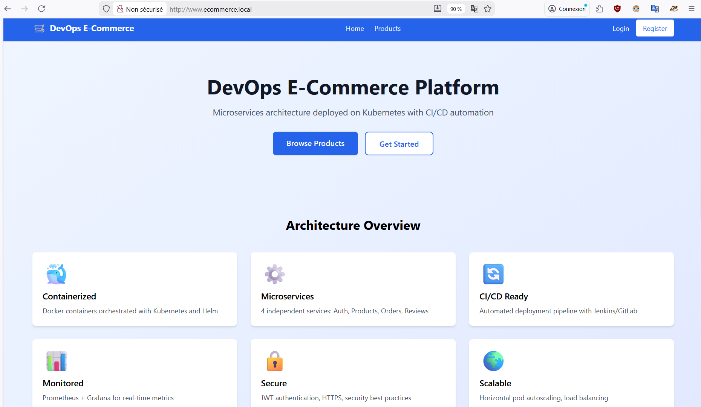

# 🛒 E-Commerce Frontend — Portfolio DevOps & SRE


Application React e-commerce conçue comme **support pédagogique DevOps/SRE**, démontrant la progression naturelle des infrastructures modernes : du déploiement traditionnel jusqu'à l'orchestration Kubernetes, en passant par Docker Compose et Docker Swarm.

> 💡 **Objectif Portfolio** : Chaque option de déploiement illustre une maturité infrastructure différente, avec ses trade-offs, ses cas d'usage réels et ses implications opérationnelles.



---

## 🗺️ Progression Infrastructure

Ce projet illustre **l'évolution naturelle** d'une infrastructure e-commerce, de la plus simple à la plus résiliente :

```

         Nous sommes ICI (Frontend) ──────┐
                                          ▼
                             ┌──────────────────────────┐
                             │       Frontend VM        │
                             │     192.168.56.114       │
                             │        Nodejs 18+        │
                             │          nginx           │
                             └─────────────┬────────────┘
                                           │
          ┌──────────────────────┬──────── ▼──────────┬───────────────────┐
          │                      │                    │                   │
┌─────────▼────────┐     ┌───────▼──────┐     ┌───────▼──────┐     ┌──────▼───────┐
│     Option 1     │     │   Option 2   │     │   Option 3   │     │   Option 4   │
│ VM + Nginx + PM2 │───▶ |   Docker     │───▶ │   Docker     │───▶ │ Kubernetes   │
│   (Ops/Sysadm)   │     │   Compose    │     │   Swarm      │     │   + Helm     │
│                  │     │   (DevOps)   │     │  (SRE junior)│     │ (SRE senior) │
└──────────────────┘     └──────────────┘     └──────────────┘     └──────────────┘
  Manuel, SSH              Conteneurs           Clustering           Orchestration
  Simple, direct           Isolation            HA & Scaling         Auto-healing
  Tout sur 3 VMs           Portabilité          Multi-nodes          Self-service
```

| Critère | VM Traditionnelle | Docker Compose | Docker Swarm | Kubernetes |
|---------|:-----------------:|:--------------:|:------------:|:----------:|
| **Complexité** | Faible | Faible | Moyenne | Élevée |
| **Haute Dispo** | ❌ | ❌ | ✅ | ✅ |
| **Auto-scaling** | ❌ | ❌ | ✅ partiel | ✅ HPA |
| **Auto-healing** | ❌ | ❌ | ✅ | ✅ |
| **Rolling Update** | Manuel | Manuel | ✅ | ✅ |
| **Rollback** | Manuel | Manuel | ✅ | ✅ Helm |
| **Cas d'usage** | Dev / Petite prod | Dev / Test | Prod simple | Prod complexe |

---

## ⚡ Quick Start

```bash
# Cloner le projet
git clone https://gitlab.com/yara_portfolio/devops/ecommerce/ecommerce-frontend.git
cd ecommerce-frontend

# Configurer l'environnement
cp .env.example .env
nano .env  # Définir BACKEND_URL

# Démarrer (Docker Compose)
docker compose up -d

# ✅ Frontend : http://localhost
# ✅ API via proxy : http://localhost/api
```

> **Note Architecture** : Le frontend (NGINX + React) reste identique dans les 4 options. Seule la destination du proxy `/api` change selon l'architecture backend choisie (Monolithique, Swarm ou Kubernetes).

---

## 📋 Prérequis

| Outil | Version Min | Usage |
|-------|-------------|-------|
| Node.js | 18+ | Build React |
| NGINX | 1.18+ | Reverse proxy (Option 1) |
| Docker | 20.10+ | Conteneurisation |
| Docker Compose | 2.0+ | Orchestration locale |

---

## ⚙️ Variables d'Environnement

| Variable | Description | Défaut | Requis |
|----------|-------------|--------|--------|
| `FRONTEND_PORT` | Port d'exposition | `80` | ❌ |
| `BACKEND_URL` | URL complète de l'API backend | — | ✅ |
| `BACKEND_HOST` | Header Host pour l'Ingress K8s | `api.ecommerce.local` | ✅ |
| `NODE_ENV` | Environnement d'exécution | `production` | ❌ |

> 💡 **Atout Docker** : `BACKEND_URL` est injecté dynamiquement via `envsubst` dans NGINX au démarrage du conteneur. Changer de backend = modifier `.env` + `docker compose down & docker compose up -d`. **Aucun rebuild requis.**

---

## 🏗️ Architecture

### Option 1 — VM Traditionnelle (Ops / Exploitation)

**Contexte :** Infrastructure classique 3-tiers. Chaque composant sur une VM dédiée.  
**Quand l'utiliser :** Environnements legacy, équipes sans Docker, conformité stricte.

```
┌─────────────────────────────────────────────────┐
│  Frontend VM (192.168.56.114)                   │ 
│  ├── NGINX (reverse proxy + static files)       │← Nous sommes ici (projet actuel)
│  └── React Build dist/ → /var/www/html/         │
└───────────────────────┬─────────────────────────┘
                        │ proxy_pass /api
┌───────────────────────▼─────────────────────────┐
│  Backend VM (192.168.56.112)                    │
│  ├── Node.js 18 + PM2 (cluster mode)            │
│  └── Backend Monolithique :3000                 │
└───────────────────────┬─────────────────────────┘
                        │ TCP 3306
┌───────────────────────▼─────────────────────────┐
│  Database VM (192.168.56.115)                   │
│  └── MariaDB 10.11 — ecommerce_db               │
└─────────────────────────────────────────────────┘
```

**Projets liés - Backend & Database:**
```
# Repo Backend
https://gitlab.com/yara_portfolio/devops/ecommerce/ecommerce-backend

# Repo Database
https://gitlab.com/yara_portfolio/devops/ecommerce/ecommerce-database
```

**Déploiement :**

```bash
# 1. Cloner et builder
git clone https://gitlab.com/yara_portfolio/devops/ecommerce/ecommerce-frontend.git
cd ecommerce-frontend
npm install && npm run build

# 2. Déployer sur NGINX
sudo mkdir -p /var/www/html/ecommerce/
sudo cp -r dist/* /var/www/html/ecommerce/
sudo chown -R www-data:www-data /var/www/html/ecommerce

# 3. Configurer NGINX
sudo nano /etc/nginx/sites-available/ecommerce
```

<details>
  <summary><strong>Configuration NGINX complète</strong></summary>

```nginx
server {
    listen 80;
    server_name ecommerce.local www.ecommerce.local 192.168.56.114;

    root /var/www/html/ecommerce;
    index index.html;

    access_log /var/log/nginx/ecommerce-access.log;
    error_log  /var/log/nginx/ecommerce-error.log;

    # SPA — Toutes les routes vers index.html
    location / {
        try_files $uri $uri/ /index.html;
    }

    # Proxy API
    # Choisir selon le backend cible :
    location /api {
        # Option 1 — Backend Monolithique
        proxy_pass http://192.168.56.112:3000;
        # Option 3 — Docker Swarm (Kong Gateway)
        # proxy_pass http://192.168.56.111:8000;
        # Option 4 — Kubernetes Ingress
        # proxy_pass http://192.168.56.111:30080;

        proxy_http_version 1.1;
        # ⚠️ Header obligatoire pour Kubernetes Ingress
        proxy_set_header Host             api.ecommerce.local;
        proxy_set_header X-Real-IP        $remote_addr;
        proxy_set_header X-Forwarded-For  $proxy_add_x_forwarded_for;
        proxy_set_header X-Forwarded-Proto $scheme;

        proxy_connect_timeout 60s;
        proxy_send_timeout    60s;
        proxy_read_timeout    60s;
    }

    # Cache assets statiques (1 an)
    location ~* \.(js|css|png|jpg|jpeg|gif|ico|svg|woff|woff2|ttf|eot)$ {
        expires 1y;
        add_header Cache-Control "public, immutable";
        access_log off;
    }

    gzip on;
    gzip_vary on;
    gzip_types text/plain text/css text/xml text/javascript
               application/javascript application/json;
}
```
</details>

```bash
# Activer et recharger
sudo ln -s /etc/nginx/sites-available/ecommerce /etc/nginx/sites-enabled/
sudo nginx -t && sudo systemctl reload nginx
```

DNS local (poste client) :
```bash
# Linux/Mac : /etc/hosts  |  Windows : C:\Windows\System32\drivers\etc\hosts
192.168.56.114  ecommerce.local www.ecommerce.local
```

---

### Option 2 — Docker Compose (DevOps / Dev & Test)

**Contexte :** Conteneurisation complète sur une ou plusieurs VMs.  
**Quand l'utiliser :** Développement local, CI/CD, déploiement rapide sans cluster.  
**Atout clé :** Image NGINX avec `envsubst` — changement de backend sans rebuild.

```
┌─────────────────────────────────────────────────┐
│  VM (une ou plusieurs)                          │
│  ├── frontend:80  (NGINX + React build) ← ICI   │
│  ├── backend:3000 (Node.js)                     │
│  └── database:3306 (MariaDB)                    │
└─────────────────────────────────────────────────┘
```
**Projets liés - Backend & Database:**
```
# Repo Backend (Option docker)
https://gitlab.com/yara_portfolio/devops/ecommerce/ecommerce-backend

# Repo Database (Option docker)
https://gitlab.com/yara_portfolio/devops/ecommerce/ecommerce-database
```

**Déploiement :**

```bash
cp .env.example .env
# Éditer BACKEND_URL selon votre cible

docker compose up -d
docker compose ps  # État : Up (healthy) après ~40s
```

**Changer de backend sans rebuild :**

```bash
# Modifier .env
BACKEND_URL=http://192.168.56.112:3000   # Monolithique
# BACKEND_URL=http://192.168.56.111:8000  # Swarm (Kong)
# BACKEND_URL=http://192.168.56.111:30080 # Kubernetes

# Redémarrer (~10 secondes)
docker compose restart frontend
```

Logs de démarrage attendus :
```
🔧 Substituting environment variables in NGINX config...
✅ NGINX configuration:
   BACKEND_URL: http://192.168.56.112:3000
   BACKEND_HOST: api.ecommerce.local
🚀 Starting NGINX...
```

---

### Option 3 — Docker Swarm (SRE / Production simple)

**Contexte :** Clustering natif Docker. Haute disponibilité sans la complexité K8s.  
**Quand l'utiliser :** Équipes qui maîtrisent Docker, production sans équipe SRE dédiée.  
**Atout clé :** Rolling updates, réplication services, Kong Gateway pour le routing.

```
┌─────────────────────────────────────────────────┐
│  Frontend VM (192.168.56.114)                   │ ← Nous sommes ici (projet actuel)
│  └── NGINX → proxy vers Kong :8000              │
└───────────────────────┬─────────────────────────┘
                        │
┌───────────────────────▼─────────────────────────┐
│  Swarm Manager (192.168.56.111)                 │
│  ├── Kong Gateway  :8000  (routing + auth)      │
│  ├── auth-service    (replicas: 2)              │
│  ├── product-service (replicas: 2)              │
│  ├── order-service   (replicas: 2)              │
│  └── review-service  (replicas: 2)              │
└───────────────────────┬─────────────────────────┘
                        │
┌───────────────────────▼─────────────────────────┐
│  Database VM (192.168.56.115)                   │
│  └── MariaDB 10.11 (externe au cluster)         │
└─────────────────────────────────────────────────┘
```

**Projets liés - Microservices (Docker Swarm) :**
```
# Repo Microservices
https://gitlab.com/yara_portfolio/devops/ecommerce/microservice

# Repo - Déployer les microservices sur Docker Swarm
https://gitlab.com/yara_portfolio/devops/ecommerce/devops-tools/docker-swarm

# Repo Database (traditionnel & docker)
https://gitlab.com/yara_portfolio/devops/ecommerce/ecommerce-database
```

---

### Option 4 — Kubernetes + Helm (SRE / Production avancée)

**Contexte :** Orchestration complète. Auto-healing, HPA, rolling updates, rollback via Helm.  
**Quand l'utiliser :** Prod à haute disponibilité, scaling automatique, équipe SRE.  
**Atout clé :** Self-healing, déploiement déclaratif, rollback en une commande.

```
┌─────────────────────────────────────────────────┐
│  Frontend VM (192.168.56.114)                   │ ← Nous sommes ici (projet actuel)
│  └── NGINX → proxy vers Ingress :30080          │
└───────────────────────┬─────────────────────────┘
                        │
┌───────────────────────▼─────────────────────────┐
│  Kubernetes Cluster (192.168.56.111)            │
│  ├── Ingress Controller  (NodePort 30080)       │
│  ├── auth-service    Pod (HPA: 2-10 replicas)   │
│  ├── product-service Pod (HPA: 2-10 replicas)   │
│  ├── order-service   Pod (HPA: 2-10 replicas)   │
│  └── review-service  Pod (HPA: 2-10 replicas)   │
└───────────────────────┬─────────────────────────┘
                        │
┌───────────────────────▼─────────────────────────┐
│  Database VM (192.168.56.115)                   │
│  └── MariaDB 10.11 (externe au cluster)         │
└─────────────────────────────────────────────────┘
```

**Projets liés - Microservices (Kubernetes) :**
```
# Repo Microservices
https://gitlab.com/yara_portfolio/devops/ecommerce/microservice

# Repo - Déployer les microservices sur Kubernetes via Helm
https://gitlab.com/yara_portfolio/devops/ecommerce/devops-tools/k8s-helm-chart

# Repo Database (traditionnel & docker)
https://gitlab.com/yara_portfolio/devops/ecommerce/ecommerce-database
```

---

## 📁 Structure du Projet

```
ecommerce-frontend/
├── .img/                       # Screenshots documentation
├── docker/                     # 🐳 Configuration Docker
│   ├── Dockerfile              # Multi-stage build (Node 18 → NGINX alpine)
│   ├── nginx.conf.template     # Template NGINX avec variables ${BACKEND_URL}
│   └── docker-entrypoint.sh    # Injection variables via envsubst au démarrage
├── src/
│   ├── components/
│   │   ├── Navbar.jsx          # Badge panier dynamique
│   │   ├── ProductCard.jsx     # Tooltip + vérification auth
│   │   ├── PrivateRoute.jsx    # Protection routes utilisateur
│   │   └── AdminRoute.jsx      # Protection routes admin
│   ├── context/
│   │   ├── AuthContext.jsx     # Gestion JWT (login, logout, expiration)
│   │   └── CartContext.jsx     # État panier global
│   ├── pages/
│   │   ├── Home.jsx
│   │   ├── Products.jsx / ProductDetail.jsx
│   │   ├── Cart.jsx / Checkout.jsx / Orders.jsx
│   │   ├── Login.jsx / Register.jsx
│   │   └── admin/              # Dashboard, Products, Orders, Reviews
│   └── services/
│       └── api.js              # Axios + gestion expiration JWT
├── docker-compose.yml
├── .env.example
├── vite.config.js
└── tailwind.config.js
```

> 💡 **Multi-stage Docker build** : L'image finale ne contient que NGINX alpine (~45MB). Node.js et les node_modules ne sont présents que pendant le build, jamais en production.

---

## 🎨 Technologies

| Catégorie | Technologie | Rôle |
|-----------|-------------|------|
| UI | React 18 | Interface utilisateur |
| Build | Vite 4 | Bundler ultra-rapide |
| Routing | React Router 6 | Navigation SPA |
| HTTP | Axios | Client API + intercepteurs JWT |
| Style | Tailwind CSS | Utility-first CSS |
| State | Context API | Auth + Panier |
| Serveur | NGINX alpine | Static files + Reverse proxy |
| Runtime | Node.js 18 | Build uniquement (multi-stage) |

---

## 🎯 Parcours Utilisateur

### Visiteur → Client

```
Accueil → Produits → Clic "Ajouter au panier"
              ↓
    ⚠️  "Vous devez être connecté"
              ↓
    Inscription → ✅ Message de confirmation
              ↓
    Redirection /login (3 secondes)
              ↓
    Connexion → JWT stocké (24h)
              ↓
    Retour produits → Ajouter au panier ✅ → Checkout
```

### Administrateur

```
Login admin → Dashboard
    ↓
Créer / modifier produits
Gérer commandes (statuts)
Modérer avis clients
```

---

## 🔐 Comptes de Test

| Rôle | Email | Password |
|------|-------|----------|
| Utilisateur | john.doe@example.com | password123 |
| Administrateur | admin@ecommerce.com | admin123 |

---

## 🔗 Projets Liés

| Composant | Repository |
|-----------|------------|
| 🗄️ Base de données | [ecommerce-database](https://gitlab.com/yara_portfolio/devops/ecommerce/ecommerce-database) |
| 🔌 Backend Monolithique | [ecommerce-backend](https://gitlab.com/yara_portfolio/devops/ecommerce/ecommerce-backend) |
| ☸️  Microservices | [microservice](https://gitlab.com/yara_portfolio/devops/ecommerce/microservice) |
| 🐝 Docker Swarm | [docker-swarm](https://gitlab.com/yara_portfolio/devops/ecommerce/devops-tools/docker-swarm) |
| ⎈ Kubernetes Helm | [k8s-helm-chart](https://gitlab.com/yara_portfolio/devops/ecommerce/devops-tools/k8s-helm-chart) |
| 🤖 Ansible Deployment | [ansible-deployment](https://gitlab.com/yara_portfolio/devops/ecommerce/ansible-deployment) |

---

## 🎥 Démos

| Sujet | Lien |
|-------|------|
| Déploiement Traditionnel & Docker Compose | *(bientôt disponible)* |
| Docker Swarm & Kubernetes | *(bientôt disponible)* |
| Monitoring Prometheus / Grafana | *(bientôt disponible)* |

---

## 👨‍💻 Auteur

**Yara Mahi Mohamed**  
Portfolio DevOps & SRE — Architecture Microservices  

Ce projet fait partie d'un portfolio complet démontrant :
- Infrastructure as Code (Ansible)
- Conteneurisation & Orchestration (Docker, Swarm, Kubernetes)
- GitOps & CI/CD (GitLab CI, Jenkins, Semaphore UI)
- Monitoring (Prometheus, Grafana, Loki)
- Architecture Microservices (Docker Stack, Helm)

---

*⭐ N'oubliez pas de star ce repo si vous le trouvez utile !*